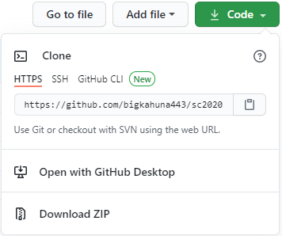

Celeste Spring Collab 2020 Randomizer
==========================

This is a collection of randomizer configuration files and routing descriptions for the [Spring Collab 2020 pack](https://gamebanana.com/maps/211745) of maps for [Celeste](http://www.celestegame.com/). 

The config is designed to be compatible with the [Celeste Randomizer](https://github.com/rhelmot/CelesteRandomizer).

**Note**: For the best experience, it is recommended to play the Collab first before playing the randomizer add-on.

Installation
------------
**Note**: Running mods with Celeste requires you to have installed [Everest](https://everestapi.github.io/).

**Automatic [not yet enabled]**:
1. Download the [Spring Collab 2020 pack](https://gamebanana.com/maps/211745).
2. The config is included by default and the Collab levels will be available in the randomizer level select screen.

[picture here]

**Manual**:
1. Download this project with the method of your choice and save it in your Celeste/Mods directory.

2. The Collab levels should now be available in the randomizer level select screen.

Difficulty Modes
----------------

The difficulty modes are intended to match the [randomizer difficulties](https://github.com/rhelmot/CelesteRandomizer#difficulty-modes) pretty closely. Normal may require tech up to the Intermediate Gym. Hard is a broad category and may require tech up to the Expert gym (same as vanilla randomizer). Expert and Perfect may require tech up to the Grandmaster gym, but are probably easier than their vanilla equivalents. Here's a rough estimate of the lobby difficulty mix (forward path, intended # of dashes) for reference:

- *Beginner Lobby*: 95% Normal, 5% Hard
- *Intermediate Lobby*: Around half Normal, half Hard
- *Advanced Lobby*: 20% Normal, 75% Hard, 5% Expert
- *Expert Lobby*:
- *Grandmaster Lobby*:

The ratings are based on difficulty of execution and assume that you have played the collab before. If you haven't, some screens may be harder than the ratings imply (e.g. puzzle screens).

If you find new routes or would like to suggest tweaks or changes to difficulty ratings, feel free to contact me! I may not include pixel-perfect moves without setups, or anything that is very frustrating to execute. You can see the current difficulty ratings in the [documentation](docs/routing).

Known Issues / Planned Additions
--------------------------------
1. You may experience increased loading times due to the randomizer having to parse the configuration files for each map in the collab. Disabling the collab and/or the randomizer when not in use will decrease the load time. You can disable these through Mod Options or by manually editing "blacklist.txt" in your Mods folder. Another option is to manually move/remove the Config folder within the collab directory, but this is not recommended.

2. It ain't done.

Contact
-------

If you encounter any issues/softlocks or have suggestions, you can reach me on Discord (Bigkahuna#0491). To minimize issues, use the latest version of the config and the randomizer mod. Please include randomizer version, seed, and settings in any bug reports.

Credits
-------

**Creator**: Bigkahuna

**Labber-in-Chief**: [Theta](https://www.twitch.tv/thetagc)

**Collab Support**:
* max480
* Cruor
* Thegur90

**Randomizer Support**:
* Rhelmot
